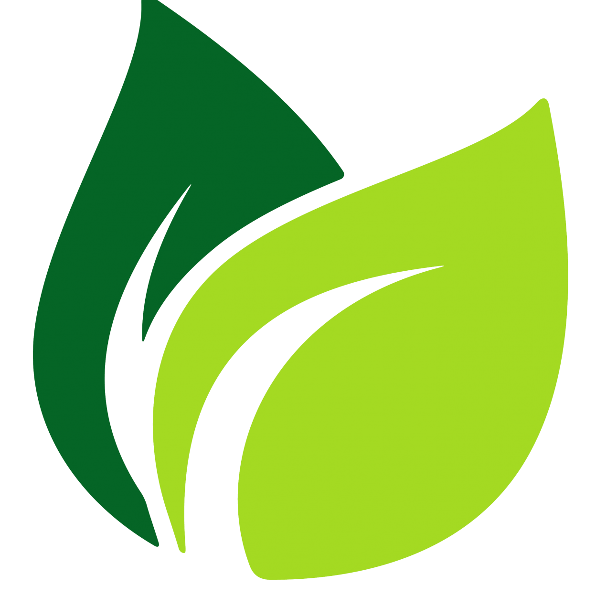

<!-- Improved compatibility of Voltar ao topo link: See: https://github.com/othneildrew/Best-README-Template/pull/73 -->
<a name="readme-top"></a>
<!--
*** Thanks for checking out the Best-README-Template. If you have a suggestion
*** that would make this better, please fork the repo and create a pull request
*** or simply open an issue with the tag "enhancement".
*** Don't forget to give the project a star!
*** Thanks again! Now go create something AMAZING! :D
-->


<!-- PROJECT SHIELDS -->
<!--
*** I'm using markdown "reference style" links for readability.
*** Reference links are enclosed in brackets [ ] instead of parentheses ( ).
*** See the bottom of this document for the declaration of the reference variables
*** for contributors-url, forks-url, etc. This is an optional, concise syntax you may use.
*** https://www.markdownguide.org/basic-syntax/#reference-style-links
-->

<!-- PROJECT LOGO -->
<br />
<div align="center">
  <a href="https://github.com/thalysonluiz/README-Template">
    
  </a>

  <h3 align="center">README-Template</h3>

  <p align="center">
    README template para projetos!
    <br />
    <br />
    <a href="https://github.com/demo">View Demo</a>
    ·
    <a href="https://github.com/thalysonluiz/README-Template/issues/new?labels=bug&template=bug-report---.md">Report Bug</a>
    ·
    <a href="https://github.com/thalysonluiz/README-Template/issues/new?labels=enhancement&template=feature-request---.md">Request Feature</a>
  </p>
</div>

<p align="center">
  
  
  
  
  
  
</p>

<!-- TABLE OF CONTENTS -->
  ### Sumário
  <ol>
    <li>
      <a href="#about-the-project">About The Project</a>
      <ul>
        <li><a href="#built-with">Built With</a></li>
      </ul>
    </li>
    <li>
      <a href="#getting-started">Getting Started</a>
      <ul>
        <li><a href="#prerequisites">Prerequisites</a></li>
        <li><a href="#installation">Installation</a></li>
      </ul>
    </li>
    <li><a href="#usage">Usage</a></li>
    <li><a href="#roadmap">Roadmap</a></li>
    <li><a href="#contributing">Contributing</a></li>
    <li><a href="#license">License</a></li>
    <li><a href="#contact">Contact</a></li>
    <li><a href="#acknowledgments">Acknowledgments</a></li>
  </ol>
<br>


<!-- ABOUT THE PROJECT -->
## Descrição do Projeto

[![Product Name Screen Shot][product-screenshot]](https://example.com)

Breve descrição do projeto

<p align="right">(<a href="#readme-top">Voltar ao topo</a>)</p>


<!--https://github.com/simple-icons/simple-icons/blob/master/slugs.md-->
### 🛠 Tecnologias Utilizadas

This section should list any major frameworks/libraries used to bootstrap your project. Leave any add-ons/plugins for the acknowledgements section. Here are a few examples.

* [![Next][Next.js]][Next-url]
* &nbsp;
* &nbsp;
* &nbsp;
* &nbsp;
* &nbsp;
* &nbsp;
* &nbsp;
* &nbsp;
* &nbsp;
* &nbsp;
* &nbsp;

<p align="right">(<a href="#readme-top">Voltar ao topo</a>)</p>


<!-- GETTING STARTED -->
## Começando

Exemplo para executar o projeto local.
Começar com repositório local e seguir os passos a seguir.

### Pré-requisitos

É necessário ter o XXX instalado.
* npm
  ```sh
  npm install npm@latest -g
  ```

### Instalação

_..._

1. Get a free API Key at [https://example.com](https://example.com)
2. Clone the repo
   ```sh
   git clone https://github.com/your_username_/Project-Name.git
   ```
3. Install NPM packages
   ```sh
   npm install
   ```
4. Enter your API in `config.js`
   ```js
   const API_KEY = 'ENTER YOUR API';
   ```

<p align="right">(<a href="#readme-top">Voltar ao topo</a>)</p>


<!-- USAGE EXAMPLES -->
## Como usar

Use this space to show useful examples of how a project can be used. Additional screenshots, code examples and demos work well in this space. You may also link to more resources.

_For more examples, please refer to the [Documentation](https://example.com)_

<p align="right">(<a href="#readme-top">Voltar ao topo</a>)</p>


<!-- ROADMAP -->
## Roteiro

- [x] Add Changelog
- [x] Add Voltar ao topo links
- [ ] Add Additional Templates w/ Examples
- [ ] Add "components" document to easily copy & paste sections of the readme
- [ ] Multi-language Support
    - [ ] Chinese
    - [ ] Spanish

See the [open issues](https://github.com/thalysonluiz/README-Template/issues) for a full list of proposed features (and known issues).

<p align="right">(<a href="#readme-top">Voltar ao topo</a>)</p>


<!-- CONTRIBUTING --
## Contributing

Contributions are what make the open source community such an amazing place to learn, inspire, and create. Any contributions you make are **greatly appreciated**.

If you have a suggestion that would make this better, please fork the repo and create a pull request. You can also simply open an issue with the tag "enhancement".
Don't forget to give the project a star! Thanks again!

1. Fork the Project
2. Create your Feature Branch (`git checkout -b feature/AmazingFeature`)
3. Commit your Changes (`git commit -m 'Add some AmazingFeature'`)
4. Push to the Branch (`git push origin feature/AmazingFeature`)
5. Open a Pull Request

<p align="right">(<a href="#readme-top">Voltar ao topo</a>)</p>


<!-- LICENSE -->
## License

Distributed under the MIT License. See `LICENSE.txt` for more information.

<p align="right">(<a href="#readme-top">Voltar ao topo</a>)</p>


<!-- CONTACT -->
## Autor

<div style="display: flex;">
<p style="display: flex; flex-direction: column; justify-content: center; align-items: center">                            
 
 <br />
 <sub><b>Thalyson Luiz</b></sub>
</p>
</div>

<p align="right">(<a href="#readme-top">Voltar ao topo</a>)</p>

## 👨🏽‍🦲 &nbsp;Social Links

<!--<p align="left" style="background:yellow">
<a href="https://codepen.io/maykbrito" target="_blank">
  
</a>
<a href="https://twitter.com/maykbrito" target="_blank">
    
</a>
<a href="https://linkedin.com/in/maykbrito" target="_blank">
  
</a>
<a href="https://instagram.com/maykbrito" target="_blank">
 
</a>
<a href="https://youtube.com/maykbrito" target="_blank">
 
</a>
</p>-->


<!-- MARKDOWN LINKS & IMAGES -->
<!-- https://www.markdownguide.org/basic-syntax/#reference-style-links -->
[contributors-shield]: https://img.shields.io/github/contributors/othneildrew/Best-README-Template.svg?style=for-the-badge
[contributors-url]: https://github.com/othneildrew/Best-README-Template/graphs/contributors
[forks-shield]: https://img.shields.io/github/forks/othneildrew/Best-README-Template.svg?style=for-the-badge
[forks-url]: https://github.com/othneildrew/Best-README-Template/network/members
[stars-shield]: https://img.shields.io/github/stars/othneildrew/Best-README-Template.svg?style=for-the-badge
[stars-url]: https://github.com/othneildrew/Best-README-Template/stargazers
[issues-shield]: https://img.shields.io/github/issues/othneildrew/Best-README-Template.svg?style=for-the-badge
[issues-url]: https://github.com/othneildrew/Best-README-Template/issues
[license-shield]: https://img.shields.io/github/license/othneildrew/Best-README-Template.svg?style=for-the-badge
[license-url]: https://github.com/othneildrew/Best-README-Template/blob/master/LICENSE.txt
[linkedin-shield]: https://img.shields.io/badge/-LinkedIn-black.svg?style=for-the-badge&logo=linkedin&colorB=555
[linkedin-url]: https://linkedin.com/in/othneildrew
[product-screenshot]: images/screenshot.png
[Next.js]: https://img.shields.io/badge/-Nextjs-05122A?style=flat&logo=nextdotjs
[Next-url]: https://nextjs.org/
[React.js]: https://img.shields.io/badge/React-20232A?style=for-the-badge&logo=react&logoColor=61DAFB
[React-url]: https://reactjs.org/
[Vue.js]: https://img.shields.io/badge/Vue.js-35495E?style=for-the-badge&logo=vuedotjs&logoColor=4FC08D
[Vue-url]: https://vuejs.org/
[Angular.io]: https://img.shields.io/badge/Angular-DD0031?style=for-the-badge&logo=angular&logoColor=white
[Angular-url]: https://angular.io/
[Svelte.dev]: https://img.shields.io/badge/Svelte-4A4A55?style=for-the-badge&logo=svelte&logoColor=FF3E00
[Svelte-url]: https://svelte.dev/
[Laravel.com]: https://img.shields.io/badge/Laravel-FF2D20?style=for-the-badge&logo=laravel&logoColor=white
[Laravel-url]: https://laravel.com
[Bootstrap.com]: https://img.shields.io/badge/Bootstrap-563D7C?style=for-the-badge&logo=bootstrap&logoColor=white
[Bootstrap-url]: https://getbootstrap.com
[JQuery.com]: https://img.shields.io/badge/jQuery-0769AD?style=for-the-badge&logo=jquery&logoColor=white
[JQuery-url]: https://jquery.com 
